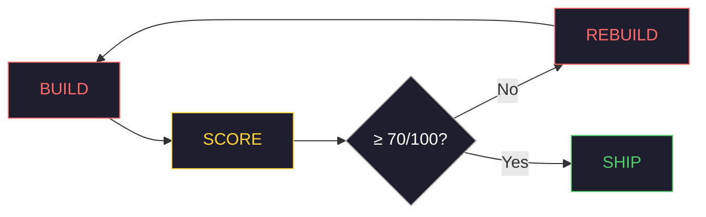

<div align="center">


</div>

# ZeroSlop

You spend 20 hours building. The UI looks clean. The features are there. The demo flow is rehearsed. The judge walks over. You click the button. Nothing happens.

Three hackathons. Every project vibecoded. Every demo broke when it mattered.

Not because AI is bad at building. Because AI has no judgment about what it builds.

It ships. It calls things done. It moves on.

**zeroslop fixes that.**

---

## What actually happens when you vibe code under pressure

You have 24 hours. You're moving fast. By hour 20 the demo looks incredible.

Then the judge walks over.

- Form submits to nowhere — no handler, no DB write, just silence
- Backend built. Frontend built. Never wired together.
- Works on your machine. `localhost` hardcoded in a config value the AI invented.
- Leaderboard showing numbers. Fake numbers. The table was never created.
- Auth session variable the AI made up — your actual one is two files away, unused.
- CORS errors, undefined references, missing responses — silent on the surface, on fire underneath.
- API keys hardcoded in the frontend. Right there in devtools.
- No error states. Failures look like success.
- CSRF tokens on zero forms.
- Mobile layout collapses at 375px. You find out in real time.
- Inter font. Purple gradient on white. Identical to every other team in the room.
- AI said it was done. Confidently. No caveats.

The tools weren't wrong. The prompting wasn't wrong. The process had no gate between "written" and "actually works."

---

## What zeroslop is

A structured development methodology you clone into your IDE.

Not a SaaS. Not a CLI tool. Not a wrapper.

You clone the repo. The AI reads the files. From that point it operates with a full pipeline — quality gates, self-scoring, design intelligence, codebase grounding — running on everything it builds.

**Two pastes. Total transformation.**

```
Paste 1 → zeroslop loads into your AI session
          Generic assistant → full development pipeline

Paste 2 → Your codebase loads
          AI enters GROUNDED MODE
          Builds YOUR code — not invented code
```

---

## The core loop



After every feature, the AI scores its own output across six dimensions.

```
┌─────────────────────────────────────────────┐
│ ZEROSLOP SELF-SCORE: [Feature Name]         │
│                                             │
│ Backend:      __/25   Frontend:   __/20     │
│ Data:         __/15   Connect:    __/15     │
│ Quality:      __/15   Evidence:   __/10     │
│                                             │
│ TOTAL:        __/100                        │
│                                             │
│ Honest notes: [what is weak or incomplete]  │
└─────────────────────────────────────────────┘
```

**Below 70 = rebuild. Not a patch. Rebuild.**

This sounds obvious. No AI tool enforces it without zeroslop. They patch. They bandage. They keep adding to broken foundations.

---

## Before / after

Same prompt. Same AI. Different system.

| | Without zeroslop | With zeroslop |
|---|---|---|
| **Schema** | Invents a random DB schema | Uses your actual table: `roll_no, full_name, email, password_hash, branch, batch` |
| **Auth** | `$_SESSION['user_id']` — doesn't exist here | `$_SESSION['roll_no']` — exactly as your auth pattern shows |
| **DB** | Password hardcoded in handler | `getDB()` from `config.php`, zero hardcoded credentials |
| **Security** | No CSRF token | CSRF token, PDO prepared statements |
| **Design** | Inter + purple gradient on white | Category design system — not defaults |
| **Utilities** | Ignores your helpers | Calls `createNotification()`, `awardPoints()` — already in your repo |
| **States** | No error handling | 5 visible states on every input |
| **Mobile** | Breaks at 375px | Verified at 375px |
| **Score** | 38/100 | 91/100 |
| **Judge** | Next team. | It works. |

---

## The 8-stage pipeline

| Stage | What it does | Output |
|---|---|---|
| **1 — COLD-READ** | Ingests your codebase DNA: schema, utilities, conventions, dead zones, auth pattern. Enters GROUNDED MODE. | Your functions. Your session keys. Your table names. Never invented. |
| **2 — SCOUT** | Researches competitors, GitHub alternatives, APIs, market gaps. | MARKET-INTEL report before a line is written. |
| **2b — DESIGN-SCOUT** | Detects your product category. Studies reference-class design. Reviews your existing UI. Finds every flaw. | Locked design system: colors, type, components, motion profile. |
| **3 — VALIDATE** | Competitive matrix. Moat check. | Honest verdict: BUILD / PIVOT / STOP. |
| **4 — INTERROGATE** | Max 7 surgical questions. Each one unlocks a specific architecture decision. Binary options — A changes 3 files, B changes 12. | No questions about business models. Only what changes real code. |
| **5 — RATE** | Full requirement scoring before line one. Complexity, feasibility, risks, phase plan. | No "I didn't realize this would take 3 weeks" at week 3. |
| **6 — ORCHESTRATE** | Agent dependency graph. DB → AUTH → BACKEND → UI → SECURITY → QA → FINE-TUNE. | Nothing starts until its dependency gates. Nothing ships without passing. |
| **7 — EXECUTE** | Builds under strict rules. No stubs. No TODOs. No hardcoded credentials. Backend before frontend. Every external input validated. Every DB query uses prepared statements. | Shippable output. |
| **8 — FINE-TUNE** | Repo-aware consistency pass. | New code becomes indistinguishable from code that's been in the project for 6 months. |

---

## The four gates

Every feature passes through all four before it ships.
Gates are not optional. Gates have no exceptions.

```
COMPLETENESS-GATE   Every input has a destination.
                    Every button does something real.
                    Every route returns something.
                    Every error is handled visibly.
                    At least 3 edge cases identified
                    and handled.

SECURITY-GATE       CSRF on all forms.
                    PDO prepared statements on all queries.
                    No hardcoded credentials anywhere.
                    Auth enforced on all protected routes.
                    IDOR checks on user-owned data.

DESIGN-GATE         Color system compliant.
                    Typography locked to brief.
                    Components match spec.
                    Zero slop flags.
                    Mobile verified at 375px.
                    Signature element present — not generic.

REGRESSION-GATE     New feature didn't break old features.
                    Schema changes didn't orphan queries.
                    Auth system still intact.
                    Navigation still works end to end.
```

---

## The design intelligence layer

Most AI frontend output is identical. Same Inter. Same purple gradient. Same cards.

DESIGN-SCOUT fixes this permanently.

1. Detects your product category (AI SaaS / Fintech / Healthcare / Campus / etc.)
2. Studies reference-class design for that category — modal.com, fey.com, antimetal.com, composio.dev, silnahealth.com, and 40+ others organized by category
3. Reviews your existing UI against that standard
4. Runs a 12-dimension critique — specific, surgical, not "make it more modern"
5. Produces a locked design system: exact CSS variables, font pair, component specs, motion profile
6. Hands it to UI-AGENT which builds from brief, not from defaults

**Before:** AI builds with Inter + purple gradient.
**After:** AI builds with your product category's actual design language.

---

## Works on everything you're already using

zeroslop doesn't compete with other tools. It wraps them.

```
Already using superpowers?   zeroslop adds quality gates after each skill
Already using GSD?           zeroslop adds gates between each phase
Using Cursor?                zeroslop adds COLD-READ + FINE-TUNE layer
Using nothing?               zeroslop works standalone
```

The `adapters/` folder has exact integration instructions for each.

---

## Quick start

```bash
# Clone into your IDE workspace
git clone https://github.com/hotaro6754/ZeroSlop.git

# Open a new AI session (Claude / GPT-4 / Gemini / Cursor)

# Copy BOOT.md
cat ZeroSlop/BOOT.md | pbcopy          # macOS
cat ZeroSlop/BOOT.md | xclip -sel clip # Linux

# Paste into your AI session
# Then paste your codebase or idea
# Done
```

No CLI. No configuration. No setup beyond cloning.

BOOT.md contains embedded versions of all protocols. One file is enough to start. The rest of the files deepen each stage when you need them.

---

## File structure

```
zeroslop/
├── BOOT.md                    ← Start here. One file, full pipeline.
├── README.md
│
├── core/
│   ├── 01-COLD-READ.md        ← Repo ingestion + GROUNDED MODE
│   ├── 02-SCOUT.md            ← Market intelligence
│   ├── 02b-DESIGN-SCOUT.md    ← Design intelligence + UI critique
│   ├── 03-VALIDATE.md         ← Idea validation + moat analysis
│   ├── 04-INTERROGATE.md      ← Surgical pre-build questioning
│   ├── 05-RATE.md             ← Requirement scoring
│   └── 06-ORCHESTRATE.md      ← Agent graph + task decomposition
│
├── agents/
│   ├── FINE-TUNE-AGENT.md     ← The 1000x consistency pass
│   └── [DB, AUTH, UI, SECURITY, QA agents]
│
├── gates/
│   ├── COMPLETENESS-GATE.md   ← Every feature fully wired
│   ├── SECURITY-GATE.md       ← 10 security checks per feature
│   ├── DESIGN-GATE.md         ← Slop detection + spec compliance
│   └── REGRESSION-GATE.md     ← New code doesn't break old code
│
├── profiles/
│   ├── saas.md
│   ├── campus-platform.md
│   ├── fintech.md
│   └── healthcare.md
│
└── adapters/
    ├── cursor.md
    ├── gsd.md
    └── standalone.md
```

---

## Built by

Harshith Gangaraju.

Three hackathons. Everything vibecoded. Judge walks over, something breaks.

Spent a long time blaming the prompts. The prompts were fine.

The AI just had no mechanism to check whether what it built actually worked.

zeroslop is the system I built so it never happens again. To me or anyone else.

---

*If this saves your next demo, star the repo.*
*If something doesn't work for your setup, open an issue and tell me why.*

---

*zeroslop — no more slop. ship real things.*
https://hotaro6754.github.io/ZeroSlop/
