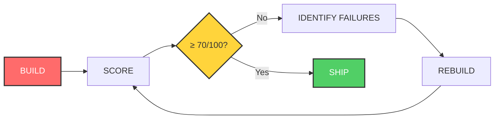

```markdown
<div align="center">


<br/><br/>


<br/>

<h1>
  
</h1>

<p><strong>A structured development methodology that forces AI to ship quality, not slop.</strong></p>

<p>
  <a href="#quick-start">🚀 Quick Start</a> •
  <a href="#the-pipeline">Pipeline</a> •
  <a href="#gates">Quality Gates</a> •
  <a href="#adapters">Adapters</a> •
  <a href="#contributing">Contribute</a>
</p>


</div>

---

## 🔥 The Problem (Every Hackathon Dev Knows This)

<div align="center">

| Without ZeroSlop | With ZeroSlop |
|:---:|:---:|
| Form submits to nowhere | Every input has a destination |
| `$_SESSION['user_id']` invented by AI | Uses your actual `$_SESSION['roll_no']` |
| Inter + purple gradient (again) | Category-appropriate design system |
| Hardcoded DB password in handler | Zero hardcoded credentials |
| Works on localhost only | Production-ready from commit 1 |
| **Demo dies when judge arrives** | **Judge sees it actually work** |

</div>

> *"Three hackathons. Everything vibecoded. Judge walks over, something breaks. Spent months blaming the prompts. The prompts were fine. The AI just had no mechanism to check whether what it built actually worked."*
> 
> **— Harshith, Creator of ZeroSlop**

---

## ⚡ What Makes This Different

**Not a SaaS. Not a CLI. Not a wrapper.**

ZeroSlop is a **methodology you clone into your IDE**. The AI reads the files, then operates with a full quality pipeline running on everything it builds.

```

┌─────────────────────────────────────────────────────────┐
│  PASTE 1: ZeroSlop loads → Generic AI becomes           │
│           full development pipeline with quality gates  │
├─────────────────────────────────────────────────────────┤
│  PASTE 2: Your codebase loads → AI enters GROUNDED MODE │
│           Uses YOUR functions. YOUR auth. YOUR schema.  │
│           Never invents. Never assumes.                 │
└─────────────────────────────────────────────────────────┘

```

---

## 🎯 The Core Loop



Below 70 = rebuild. Not patch. Rebuild. This is what no other AI tool enforces.

---

🏭 The 8-Stage Pipeline

Stage	Purpose	Output	
1. COLD-READ	Ingest your codebase DNA	GROUNDED MODE activated	
2. SCOUT	Research competitors & APIs	MARKET-INTEL report	
2b. DESIGN-SCOUT	Study category design patterns	Locked design system	
3. VALIDATE	Check moat & feasibility	BUILD / PIVOT / STOP verdict	
4. INTERROGATE	7 surgical architecture questions	Binary decision tree	
5. RATE	Score complexity & risks	Phase plan with timelines	
6. ORCHESTRATE	Agent dependency graph	Execution order locked	
7. EXECUTE	Build under strict rules	No stubs. No TODOs.	
8. FINE-TUNE	1000x consistency pass	Code indistinguishable from legacy	

---

🚪 The Four Gates 

Gate	Enforces	Catches	
🔒 COMPLETENESS	Every input has destination	Ghost buttons, dead forms	
🛡️ SECURITY	CSRF, PDO, no hardcoded keys	Auth bypass, SQL injection	
🎨 DESIGN	Category-appropriate UI	Generic gradients, mobile breakage	
🔄 REGRESSION	New code doesn't break old	Schema orphans, broken nav	

Gates are not optional. Gates have no exceptions.

---

🚀 Quick Start 

```bash
# 1. Clone into your IDE workspace
git clone https://github.com/hotaro6754/ZeroSlop.git

# 2. Open new AI session (Claude/GPT-4/Gemini/Cursor)

# 3. Paste BOOT.md contents
cat ZeroSlop/BOOT.md | pbcopy  # macOS
# cat ZeroSlop/BOOT.md | xclip -selection clipboard  # Linux

# 4. Paste your codebase or idea
# 5. Watch it work with quality gates
```

No CLI. No config. Two pastes. Total transformation.

---

🔌 Adapters 

ZeroSlop wraps what you already use:

Your Stack	ZeroSlop Adds	
Cursor	COLD-READ + FINE-TUNE layer	
Superpowers	Quality gates after each skill	
GSD	Gates between each phase	
Vanilla AI	Full pipeline standalone	

See `adapters/` folder for exact integration instructions.

---

📊 Star History

[](https://star-history.com/#hotaro6754/ZeroSlop&Date)

---

🏆 Used By

If you're using ZeroSlop in production or hackathons, [add yourself!](CONTRIBUTING.md)

- 🥇 Hackathon teams shipping demos that actually work
- 🏢 Solo founders building MVPs without technical debt
- 👥 Engineering teams adding quality gates to AI workflows

---

📁 Repository Structure

```
zeroslop/
├── BOOT.md                    ← Start here. One file = full pipeline.
├── core/
│   ├── 01-COLD-READ.md        ← Repo ingestion + GROUNDED MODE
│   ├── 02-SCOUT.md            ← Market intelligence
│   ├── 02b-DESIGN-SCOUT.md    ← Design intelligence layer
│   ├── 03-VALIDATE.md         ← Idea validation + moat analysis
│   ├── 04-INTERROGATE.md      ← Surgical pre-build questions
│   ├── 05-RATE.md             ← Requirement scoring
│   └── 06-ORCHESTRATE.md      ← Agent dependency graph
├── agents/
│   ├── FINE-TUNE-AGENT.md     ← The 1000x consistency pass
│   └── [DB, AUTH, UI, SECURITY, QA agents]
├── gates/
│   ├── COMPLETENESS-GATE.md   ← Every feature fully wired
│   ├── SECURITY-GATE.md       ← 10 security checks
│   ├── DESIGN-GATE.md         ← Slop detection
│   └── REGRESSION-GATE.md     ← No breakage
├── profiles/                  ← Category-specific design systems
└── adapters/                  ← Cursor, GSD, standalone
```

---

🤝 Contributing 

```bash
# Found a gate bypass? Open an issue.
# Built a new adapter? PR welcome.
# Used it in a hackathon? Tell your story.
```

[](http://makeapullrequest.com)
[](https://github.com/hotaro6754/ZeroSlop/issues)

---

📜 License

MIT © [Harshith Gangaraju](https://github.com/hotaro6754)

---

⭐ Star this repo if it saved your demo

[🚀 Get Started](#quick-start) • [📖 Documentation](core/) • [🐛 Issues](../../issues)

ZeroSlop — No more slop. Ship real things.

---
